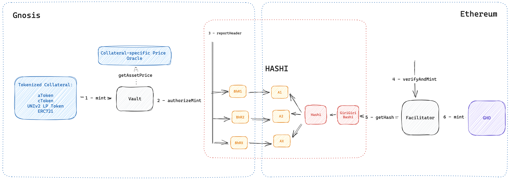

# FRAGOLA - the FRAmework for GhO cross-Ledger Access


[](https://github.com/crosschain-alliance/gho-fragola/blob/develop/LICENSE.md)



## Overview

...

&nbsp;

***

&nbsp;

## How it works

...


&nbsp;

***

&nbsp;

## Installation and Usage

### Prerequisites

Ensure you have [Node.js](https://nodejs.org/) and [npm](https://www.npmjs.com/) installed.

### Clone the Repository

```bash
git clone https://github.com/crosschain-alliance/gho-fragola.git
cd gho-fragola
```

### Install Dependencies

```bash
npm install
```

### Compile Contracts

```bash
npm run compile
```

&nbsp;

***

&nbsp;

## Testing

Before running the tests, make sure you've set up the required environment variables.

```bash
npm run test
```

&nbsp;

***

&nbsp;

## Contribution

Pull requests are welcome. For major changes, please open an issue first to discuss what you would like to change.

&nbsp;

***

&nbsp;

## License

This project is licensed under the MIT License - see the [LICENSE](LICENSE) file for details.


&nbsp;

***

&nbsp;
## Contact

For any inquiries, issues, or feedback, please [raise an issue on GitHub](https://github.com/crosschain-alliance/gho-fragola/issues) or contact the team through our [official website](#).

&nbsp;

***

&nbsp;

## ⚠️ Security and Development Disclaimer

All contracts in this repository are still under active development. Although GHO Cross Chain Facilitator endeavors to ensure the highest level of security and reliability, the evolving nature of software development means that these contracts may contain unforeseen issues or vulnerabilities.

While we strive to provide a secure and robust platform through the integration of multiple oracles and other advanced features, it's crucial for users, developers, and integrators to understand the inherent risks associated with smart contracts and blockchain protocols.

All contracts have undergone thorough testing and reviews, but this doesn't guarantee they are free from errors or security vulnerabilities. Use them at your own risk.
